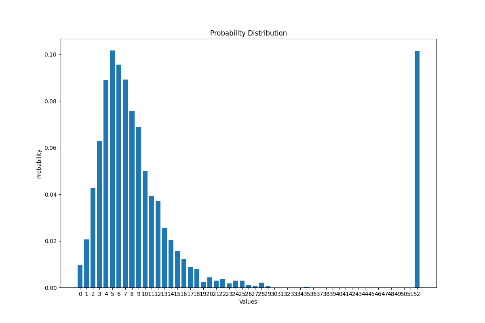

# Las Vegas Klondike Solitaire

Las Vegas Klondike Solitaire (LVKS) is a complete game engine featuring: foundation pile management, stock/waste mechanics, tableau management, and auto-play. The program uses a Monte Carlo simulation to estimate the engine's 
win-rate and the probability of $x$ cards returned foundation pile over a course of $n$ independent games. 

LVKS has an average win-rate of 10%. It displays a probability distribution graph after all runs have been made, which shows the probability of $x$ cards played onto the foundation pile. See an ***[example](#example-output)***.


---

## Table of Contents

- [Installation](#installation)
- [Instructions](#instructions)
- [What is a Win](#what-is-a-win)
  - [Buy-in](#buy-in)
- [Example Output](#example-output)
  - [Why Is There a Large Spike at 52?](#why-is-there-a-large-spike-at-52) 
     - [An Interesting Question](#an-interesting-question) 
---

## Installation

1. Clone the repository:

```bash
git clone https://github.com/Pouria-Salekani/Las-Vegas-Klondike-Solitaire
```

2. Navigate into the project directory:

```bash
cd Las-Vegas-Klondike-Solitaire
```

3. Install dependencies:

```bash
pip install -r requirements.txt
```

4. Run the application:

```bash
python main.py
```

---

## Instructions

This is a desktop-terminal program, so all display is on the terminal. The instructions are pretty simple and the code does contain comments to help out.

### Changing RUNS

In _main.py_, "RUNS" is how many times the program runs. To see the full effect, COMMENT out "moves per run" loop in _main.py_ and make RUNS = 3000 (the more iterations, the more accurate the results but time-wise is slower).
```python
RUNS = 3000

=== COMMENT THIS OUT ===
for k, v in solitaire.print_values.items():
    if i == 0:
        print()
    print(f'MOVE {k}')
    for vals in v:
        print(vals, '\n')
    print('---------------------------------------------------------------------------------------------------------------------------------------')
```
To see how **MOVES** are displayed and avoiding over-cluttering, make RUNS = 1 and run the program. The "moves per run" loop should be uncommented by default. 

---

## What is a Win

It is important to understand what constitutes a win. A _win_ is defined when **ALL** 52 pile cards are moved onto the foundation pile. However, some might prefer a win to be when you break-even.

---

### Buy-in

The typical Vegas Klondike buy-in is $52, which is $1 per card. For every card played onto the foundation pile, thats $5 won. A win is defined to be $260 (52 cards played back) and
the break-even point is defined to be $55 (11 cards played back).

<u>***Note:***</u> The program's "distribution" variable displays the number of cards played back onto the foundation pile and the frequency of that number. For example, 11: 223 means 11 cards has been played 
back onto the foundation pile 223 times.

---

## Example Output

Below is an example output of a probability distribution of 3000 independent samples.

<p align="center">
  
</p>

---

### Why Is There a Large Spike at 52?

As more cards are played onto the foundation pile, the possible game state decreases (moves become predictable). This leads to near-complete games to end more likely in a win.

---

#### An Interesting Question

Now, an interesting question would be: is there a value, $\theta$, within [0,52] where after $\theta$ a win is _always_ guaranteed? It is obvious if $\theta = 50$ that means there are $2$ cards
left to play, then obviously a win is going to be forced.

This is indeed something to ponder about.

